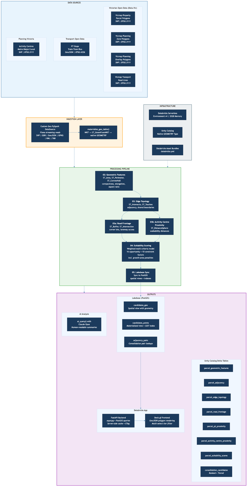

# Showcase & Demo Script: Victorian Site Consolidation Suitability Analysis

**Built with:** Databricks Spatial SQL, Unity Catalog, Custom PySpark DataSource, Claude AI
**Domain:** Victorian land use planning & housing policy
**Author:** Danny Wong
**Date:** March 2026

---

## Executive Summary

This project demonstrates how **Databricks Spatial SQL** can solve a real-world urban planning challenge: identifying which land parcels across Victoria are the best candidates for **site consolidation** - merging adjacent small lots into larger, more developable sites.

Victoria's Housing Statement sets ambitious targets for new housing supply. The **Housing Choice and Transport Zone (HCTZ)** incentivises medium-density development (3-6 storeys) near public transport, tying building height to site size. This project uses a data-driven approach to score every land parcel by its consolidation potential, helping planners and developers prioritize where to focus.

**Key capabilities demonstrated:**
- Custom PySpark DataSource for ingesting government geospatial data (SHP, GDB, GeoJSON)
- Native GEOMETRY type in Unity Catalog Delta tables
- Spatial SQL functions (ST_Area, ST_Intersects, ST_DistanceSphere, etc.) at scale
- Weighted multi-criteria scoring model with transparent, tuneable weights
- Growth-area constraints to filter out impractical consolidation candidates
- AI-powered summaries using `ai_query()` with Claude Opus
- Lakebase (PostGIS) sync for serving spatial data
- Databricks App with FastAPI + Deck.gl for interactive visualization
- Databricks Asset Bundles for reproducible deployment

---

## Architecture Overview



### System Architecture

```
 DATA SOURCES                    PROCESSING PIPELINE                    OUTPUTS
+------------------+     +----------------------------------+     +-------------------+
| Victorian Open   |     | Custom Geo DataSource            |     | Unity Catalog     |
| Data Portal      |---->| (Fiona streaming + WKT + native  |---->| Delta Tables      |
| - Vicmap Parcels |     |  GEOMETRY via ST_GeomFromWKT)    |     | with native       |
| - Planning Zones |     +----------------------------------+     | GEOMETRY type     |
| - Overlays       |                    |                         +-------------------+
| - Roads          |                    v                                  |
+------------------+     +----------------------------------+              v
| Transport Open   |     | 02: Geometric Features           |     +-------------------+
| Data Portal      |     | (area, compactness, elongation)  |     | Lakebase PostGIS  |
| - PT Stops       |     +----------------------------------+     | - candidates_geo  |
+------------------+                    |                         | - candidates_pts  |
| Planning Vic     |                    v                         | - adjacency_pairs |
| - Activity       |     +----------------------------------+     +-------------------+
|   Centres        |     | 03: Edge Topology                |              |
+------------------+     | (adjacency, shared boundaries)   |              v
                         +----------------------------------+     +-------------------+
                              /                    \              | Databricks App    |
                             v                      v             | FastAPI + Deck.gl |
               +------------------+  +-------------------+       | Interactive maps  |
               | 03a: Road        |  | 03b: Activity     |       +-------------------+
               | Frontage         |  | Centre Proximity  |              |
               +------------------+  +-------------------+              v
                              \                    /              +-------------------+
                               v                  v               | AI Summaries      |
                         +----------------------------------+     | via ai_query()    |
                         | 04: Suitability Scoring           |     | with Claude Opus  |
                         | (growth-area constraints +        |     +-------------------+
                         |  weighted multi-criteria model)   |
                         +----------------------------------+
                                        |
                                        v
                         +----------------------------------+
                         | 05: Lakebase Sync                 |
                         | (PostGIS views + spatial indexes)  |
                         +----------------------------------+
```

### Pipeline DAG (from databricks.yml)

```
  02_geometric_features
          |
          v
  03_edge_topology
        /    \
       v      v
 03a_road   03b_activity
 _frontage  _centre_proximity
       \      /
        v    v
  04_suitability_scoring
          |
          v
  05_lakebase_sync --> Databricks App
```

Stages 3a and 3b run **in parallel** after edge topology completes, both feeding into the final scoring stage. Stage 05 syncs results to Lakebase (PostGIS) which serves the Databricks App. This DAG is defined in `databricks.yml` and executed as a Databricks Workflow.

---

## Project Structure Walkthrough

```
vic-site-consolidation/
+-- databricks.yml                     # Databricks Asset Bundle config (job DAG)
+-- CLAUDE.md                          # Domain context for AI assistant
+-- README.md                          # Comprehensive project documentation
+-- LICENSE                            # MIT License
|
+-- geo_datasource/                    # Reusable custom data source
|   +-- 01_geo_datasource_definition.py   # DataSource class + Fiona reader
|   +-- 02_geo_datasource_usage.py        # Examples with Natural Earth data
|   +-- 03_spatial_sql_reference.py       # ST_* function cookbook
|
+-- land_parcel_analysis/              # Core analysis pipeline (7 notebooks)
|   +-- 01_data_ingestion.py              # Download + ingest all datasets
|   +-- 02_geometric_features.py          # Shape metrics for every parcel
|   +-- 03_edge_topology.py               # Adjacency + shared boundaries
|   +-- 03a_road_frontage_analysis.py     # Road frontage classification
|   +-- 03b_activity_centre_proximity.py  # Distance to activity centres
|   +-- 04_suitability_scoring.py         # Final scoring + ranking
|   +-- 05_lakebase_sync.py              # Sync to Lakebase PostGIS
|
+-- app/                               # Databricks App (visualization)
|   +-- app.py                            # FastAPI backend
|   +-- app.yaml                          # Databricks App config
|   +-- db.py                             # asyncpg connection pool
|   +-- models.py                         # Pydantic models
|   +-- requirements.txt                  # Python dependencies
|   +-- routes/                           # API route modules
|   |   +-- parcels.py                    # Parcel endpoints + GeoJSON with caching
|   |   +-- candidates.py                 # Consolidation candidate endpoints
|   |   +-- stats.py                      # Aggregated statistics
|   +-- static/
|       +-- index.html                    # Deck.gl + MapLibre GL frontend
|
+-- src/lakebase/
    +-- setup.sql                         # PostGIS schema, views, indexes
```

---

## Demo Script: Notebook-by-Notebook Deep Dive

### Pre-Demo Setup

1. **Workspace**: Attach to Databricks with Unity Catalog enabled
2. **Compute**: Serverless (Environment v4, High Memory 32GB recommended)
3. **Data**: Upload Victorian datasets to a UC Volume (see ingestion notebook)
4. **Time**: Full pipeline ~45-75 minutes; demo walkthrough ~30 minutes

---

### Notebook 0: Custom Geo DataSource (`geo_datasource/01_geo_datasource_definition.py`)

**Purpose:** Register a custom PySpark DataSource that can read any geospatial file format directly into Spark DataFrames.

**Why this exists:** Databricks doesn't natively read Shapefiles, GDB, or other GIS formats. Rather than converting files outside Databricks, this custom DataSource uses the Fiona library to stream-read geospatial files on the driver, partition them into chunks, and distribute them to Spark workers.

**Key classes:**

| Class | Role |
|-------|------|
| `GeoDataSource` | Entry point - registered as `spark.read.format("geo")` |
| `GeoPartition` | Represents a chunk of features (configurable `chunk_size`) |
| `GeoDataSourceReader` | Reads features using Fiona, converts geometry to WKT |

**How it works step-by-step:**

1. **Schema inference** (`_infer_schema`): Opens the file with Fiona, reads the schema metadata (not the data), and maps Fiona types to Spark types. Adds `geometry` (StringType for WKT) and `geometry_type` columns.

2. **Partitioning** (`partitions`): Counts total features, divides into chunks of `chunk_size` (default 10,000). Each chunk becomes a `GeoPartition` with start/end indices.

3. **Reading** (`read`): For each partition, opens the file with Fiona, skips to the start index, reads features one at a time (memory-efficient), converts geometry to WKT via Shapely, and yields rows as tuples.

4. **Optional CRS transform**: If a `crs` option is provided, uses PyProj to reproject each geometry during read.

**Helper functions also defined:**
- `list_geo_layers(path)` - List layers in GDB/GPKG files
- `get_geo_crs(path)` - Get the coordinate reference system
- `get_geo_count(path)` - Count features without loading data

**Usage pattern:**
```python
# Register (run once per session)
%run ../geo_datasource/01_geo_datasource_definition

# Read a shapefile
df = spark.read.format("geo").option("path", "/path/to/file.shp").load()
```

**Demo talking point:** "This is a reusable component. Any geospatial file format - Shapefiles, GDB, GeoJSON, GPKG, KML - can be loaded into Spark with a single line. The Fiona-based streaming approach means we never load the entire file into memory on the driver."

---

### Notebook 1: Data Ingestion (`land_parcel_analysis/01_data_ingestion.py`)

**Purpose:** Download, load, and materialize all source datasets into Unity Catalog Delta tables with native GEOMETRY columns.

**Datasets ingested:**

| Dataset | Source | Format | Native CRS | UC Table |
|---------|--------|--------|------------|----------|
| Vicmap Property Parcels | Data.Vic | SHP | EPSG:3111 | `parcels` |
| Vicmap Planning Zones | Data.Vic | SHP | EPSG:3111 | `zones` |
| Vicmap Planning Overlays | Data.Vic | SHP | EPSG:3111 | `overlays` |
| Vicmap Transport Roads | Data.Vic | SHP | EPSG:3111 | `roads` |
| PT Stops | Transport Open Data | GeoJSON | EPSG:4326 | `pt_stops` |
| Activity Centres | Planning Vic | SHP | EPSG:3111 | `activity_centres` |

**Key function - `materialize_geo_table()`:**

This is the critical bridge between raw WKT strings (from the custom DataSource) and native GEOMETRY columns in Delta:

```python
def materialize_geo_table(df, table_name, catalog, schema, geometry_col="geometry", source_srid=3111):
    df_with_geom = (df
        .withColumn("geom", expr(f"ST_GeomFromWKT({geometry_col}, {source_srid})"))
        .drop(geometry_col)
        .withColumnRenamed("geom", "geometry")
    )
    df_with_geom.write.mode("overwrite").option("overwriteSchema", "true").saveAsTable(f"{catalog}.{schema}.{table_name}")
```

**Why this matters:**
- `ST_GeomFromWKT(wkt, srid)` converts WKT strings to Databricks' native binary GEOMETRY type with SRID metadata
- Native GEOMETRY enables spatial indexing (H3-based) and predicate pushdown
- The SRID tag tells Databricks what coordinate system the geometry is in - critical for `ST_Transform` to work correctly later

**CRS handling:**
- All Vicmap data is in **EPSG:3111 (VicGrid GDA94)** - a projected coordinate system with meter units, ideal for area and distance calculations
- PT Stops are in **EPSG:4326 (WGS84)** - latitude/longitude, required for web maps
- The notebook correctly sets `source_srid=4326` for PT stops and `source_srid=3111` for everything else

**Demo talking point:** "Notice the `download_and_extract` helper function handles both ZIP and direct file downloads. Some Victorian government datasets require manual download due to API restrictions - the notebook provides clear instructions for those cases."

---

### Notebook 2: Geometric Features (`land_parcel_analysis/02_geometric_features.py`)

**Purpose:** Compute shape metrics for every land parcel that indicate whether it needs consolidation.

**What it does step-by-step:**

1. **Spatial Join with Zones** - Creates `parcels_with_zones` table by joining parcels to planning zones using `ST_Contains(zone.geometry, ST_Centroid(parcel.geometry))`. Uses `ROW_NUMBER()` deduplication to handle overlapping zone polygons (keeps the smallest/most specific zone).

2. **Geometric Feature Computation** - Creates `parcel_geometric_features` table with:

| Feature | Formula | Interpretation |
|---------|---------|----------------|
| `area_sqm` | `ST_Area(geometry)` | Direct from EPSG:3111 (meters). Below 500sqm = needs consolidation |
| `perimeter_m` | `ST_Perimeter(geometry)` | Relates to setback exposure |
| `est_width_m` / `est_depth_m` | Convex hull quadratic model | Rotation-invariant width/depth estimate |
| `compactness_index` | `4*pi*area / perimeter^2` | 1.0 = circle (ideal), <0.3 = irregular |
| `aspect_ratio` | `width / depth` | 1.0 = square, <1.0 = deep lot |
| `elongation_index` | `max(w,d) / min(w,d)` | >3.0 = hard to develop efficiently |
| `hull_efficiency` | `area / convex_hull_area` | 1.0 = convex, <0.6 = concave (L/T shape) |

**Clever width/depth estimation:**

Rather than using axis-aligned bounding boxes (which give wrong results for rotated parcels), the code uses a **convex hull quadratic model**:

- Compute convex hull perimeter (`P`) and area (`A`)
- Model the hull as a rectangle: `A = w*h` and `P = 2(w+h)`
- Solve the quadratic: `dimensions = P/4 +/- sqrt((P/4)^2 - A)`
- This gives rotation-invariant width/depth estimates

The code also includes a **hull efficiency guard**: when `hull_efficiency < 0.6` (concave shapes like L-shaped lots), width/depth estimates are set to NULL because the rectangular model breaks down.

3. **Derived boolean flags:**
   - `is_sliver` - area < 5sqm (data artifacts, not real lots)
   - `below_min_area_300` / `below_min_area_500` - below typical Victorian thresholds
   - `narrow_lot` - narrowest dimension < 10m
   - `below_frontage_15m` - narrowest dimension < 15m

4. **Visualization** - Folium maps colored by area size, Kepler.gl for large-scale exploration, PyDeck for 3D column charts showing area distribution.

**Demo talking point:** "The compactness index is particularly interesting - a perfectly circular lot scores 1.0, while irregular L-shaped or battleaxe lots score much lower. Parcels with poor compactness scores waste buildable area, making them strong consolidation candidates."

---

### Notebook 3: Edge Topology (`land_parcel_analysis/03_edge_topology.py`)

**Purpose:** Determine which parcels are adjacent and measure their shared boundaries - the core data for identifying consolidation partners.

**Why this is the hardest computation:**

Adjacency detection is inherently O(n^2) - you need to compare every parcel against every other parcel. For an LGA with 50,000 parcels, that's 2.5 billion potential pairs. The notebook uses several optimization strategies:

| Strategy | How | Impact |
|----------|-----|--------|
| **LGA scoping** | Filter to single LGA before cross-join | Reduces n from millions to thousands |
| **Symmetry elimination** | `p1.parcel_id < p2.parcel_id` | Halves comparisons (n^2/2) |
| **Spatial predicate first** | `ST_Intersects` before `ST_Intersection` | Filters ~99.9% of pairs early |
| **Lazy boundary extraction** | Only compute `ST_Length(ST_Intersection(...))` when `ST_Intersects` is true | Avoids expensive geometry operations on non-adjacent pairs |

**What it computes:**

1. **`parcel_adjacency` table** - Pairwise relationships:
   - `parcel_1`, `parcel_2` - the two parcel IDs
   - `touches` - boolean from `ST_Touches()` (share boundary but don't overlap)
   - `shared_boundary_m` - length of the shared edge in meters
   - `zone_1`, `zone_2` - planning zones of each parcel

2. **`parcel_edge_topology` table** - Aggregated per-parcel:
   - `num_adjacent_parcels` - count of neighbors
   - `total_shared_boundary_m` - total shared perimeter
   - `longest_shared_boundary_m` - longest single shared edge
   - `adjacent_same_zone_count` - neighbors in same planning zone
   - `is_internal_lot` - shared boundary / perimeter > 0.8
   - `is_isolated_lot` - no adjacent parcels at all
   - `has_long_shared_boundary` - longest shared edge > 15m

**Key spatial SQL pattern:**
```sql
-- The core adjacency detection query
SELECT
    p1.parcel_id AS parcel_1,
    p2.parcel_id AS parcel_2,
    ST_Touches(p1.geometry, p2.geometry) AS touches,
    ROUND(ST_Length(
        ST_Intersection(ST_Boundary(p1.geometry), ST_Boundary(p2.geometry))
    ), 2) AS shared_boundary_m
FROM sample_parcels p1
CROSS JOIN sample_parcels p2
WHERE p1.parcel_id < p2.parcel_id           -- Symmetry elimination
  AND ST_Intersects(p1.geometry, p2.geometry) -- Spatial filter first
```

**AI-powered analysis:** Uses `ai_query()` with Claude Opus to generate a human-readable summary of adjacency patterns, identifying which zones have the most consolidation potential.

**Demo talking point:** "The `is_internal_lot` flag is particularly valuable - these are parcels almost entirely surrounded by neighbors with very little street access. They have limited development potential alone but become highly valuable when consolidated with an adjacent lot that has road frontage."

---

### Notebook 3a: Road Frontage Analysis (`land_parcel_analysis/03a_road_frontage_analysis.py`)

**Purpose:** Classify how much road frontage each parcel has, what type of roads it faces, and whether it meets minimum requirements.

**Why frontage matters:**
- Victorian planning schemes typically require **minimum 15m road frontage** for new developments
- **Corner lots** (2+ road frontages) have different setback rules and are often more valuable
- **Laneway access** enables rear development, increasing consolidation attractiveness
- **Battle-axe lots** (no frontage) have the most limited development potential

**Road classification mapping:**
```
CLASS_CODE 1-2 → 'highway'    (freeways, highways)
CLASS_CODE 3-4 → 'arterial'   (major roads)
CLASS_CODE 5   → 'collector'  (medium roads)
CLASS_CODE 6   → 'local'      (residential streets)
CLASS_CODE 8   → 'laneway'    (service roads, laneways)
```

**Key spatial technique - road buffer:**

The code uses `ST_Buffer(road_geom, 20)` to create a 20-meter buffer around each road line, then checks `ST_Intersects(parcel_boundary, buffered_road)`. This is necessary because in practice, parcel boundaries don't always exactly touch road center-lines - there's often a small gap. The buffer catches these "near-touch" cases.

**Features computed:**

| Feature | Meaning |
|---------|---------|
| `num_road_frontages` | Count of distinct roads touching parcel |
| `total_frontage_m` | Sum of all road-facing edges |
| `longest_frontage_m` | Single longest road edge |
| `arterial_frontage_m` | Frontage on arterial roads |
| `local_frontage_m` | Frontage on local residential streets |
| `laneway_frontage_m` | Frontage on laneways |
| `is_corner_lot` | Has 2+ road frontages |
| `has_laneway_access` | Has laneway frontage |
| `frontage_to_perimeter_ratio` | What fraction of boundary is road |
| `meets_min_frontage_15m` | Longest frontage >= 15m |

**Demo talking point:** "Look at the frontage-to-perimeter ratio. A typical suburban lot might have 0.3 (30% of its boundary faces a road). An internal lot might have 0.05 or zero. These internal lots are the ones that most need consolidation with a road-facing neighbor."

---

### Notebook 3b: Activity Centre Proximity (`land_parcel_analysis/03b_activity_centre_proximity.py`)

**Purpose:** Calculate how close each parcel is to Plan Melbourne Activity Centres - the designated growth hubs.

**Activity Centre tiers (Plan Melbourne):**
- **Metropolitan (MAC):** Box Hill, Broadmeadows, Dandenong, Sunshine, etc. - major regional hubs
- **Major:** ~100+ significant local centres
- **Neighbourhood/Local:** Local shopping strips and small centres

**CRS detection logic:**

The notebook includes a clever auto-detection for the coordinate system. Government data sometimes has incorrect SRID tags. The code checks actual coordinate ranges:
- If X is ~144-146 and Y is ~-37 to -38 → coordinates are already WGS84 (degrees)
- If X and Y are in the millions → coordinates are VicGrid (meters)

This prevents the common error of transforming coordinates that are already in the target CRS.

**Key spatial function - `ST_DistanceSphere()`:**

```sql
ST_DistanceSphere(parcel_centroid, activity_centre_centroid)
```

This calculates great-circle distance in meters between two WGS84 points, accounting for Earth's curvature. Both inputs must be in EPSG:4326.

**Walkability thresholds (Plan Melbourne guidance):**
- **400m** - High walkability (most people will walk this)
- **800m** - Standard walkable distance (~10-minute walk)
- **1600m** - Extended walkable catchment

**Features computed:**

| Feature | Meaning |
|---------|---------|
| `nearest_mac_m` | Distance to nearest Metropolitan Activity Centre |
| `nearest_major_m` | Distance to nearest Major Activity Centre |
| `nearest_neighbourhood_m` | Distance to nearest Neighbourhood centre |
| `nearest_any_ac_m` | Distance to nearest centre (any tier) |
| `within_400m_ac` | Within high-walkability distance |
| `within_800m_ac` | Within standard walking distance |
| `within_800m_mac` | Within walking distance of a major hub |

**Demo talking point:** "Parcels within 800m of a Metropolitan Activity Centre like Dandenong or Box Hill are in the highest-growth areas. These are the places where planning policy most strongly supports consolidation and densification."

---

### Notebook 4: Suitability Scoring (`land_parcel_analysis/04_suitability_scoring.py`)

**Purpose:** Combine all features into a single weighted score that ranks every parcel by its consolidation potential.

**Step 1: PT Proximity Calculation**

Computes distance from each parcel centroid to every PT stop using a cross-join with broadcast hint:
```sql
SELECT /*+ BROADCAST(pt) */
    p.parcel_id,
    pt.MODE,
    ST_DistanceSphere(p.centroid, pt.geometry) AS distance_m
FROM parcel_centroids p
CROSS JOIN pt_stops pt
```

PT stops (~10K records) are small enough to broadcast to all executors, avoiding a shuffle of the much larger parcel table.

**Step 2: Overlay Detection**

Identifies parcels affected by constraint overlays using spatial intersection:
```sql
-- Heritage, Flood, Environmental, Vegetation overlays
LEFT JOIN overlays o ON ST_Intersects(parcel.geometry, overlay.geometry)
```

**Step 3: Multi-Criteria Scoring**

The heart of the project. Each parcel receives points based on 20+ factors:

**Opportunity Factors (positive score, max ~230 points):**

| Factor | Points | Rationale |
|--------|--------|-----------|
| HCTZ/MUZ zone | +30 | Policy priority area for densification |
| GRZ/NRZ zone | +15 | Standard residential - consolidation allowed |
| Within 800m train/tram | +20 | Transit-oriented development |
| Within 400m bus | +10 | Public transport access |
| Within 800m activity centre | +15 | Near growth hub |
| Within 800m Metro AC | +10 | Near major regional hub |
| Below 500sqm | +25 | Below minimum site area threshold |
| Below 300sqm | +10 | Critically undersized |
| Below 15m frontage | +20 | Below minimum frontage requirement |
| Narrow lot (<10m) | +10 | Very narrow - hard to develop |
| Poor compactness (<0.3) | +15 | Irregular shape wastes buildable area |
| High elongation (>3) | +10 | Elongated lots are inefficient |
| Internal lot | +20 | Limited development potential alone |
| Same-zone neighbors | +15 | Compatible consolidation partners exist |
| Long shared boundary (>15m) | +10 | Easy to merge physically |
| Laneway access | +5 | Secondary access improves potential |

**Constraint Factors (negative score, max -265 points):**

| Factor | Points | Rationale |
|--------|--------|-----------|
| Heritage overlay (HO) | -50 | Preservation requirement - can't demolish |
| Flood overlay (LSIO/SBO) | -40 | Development risk and insurance costs |
| Growth-area LGA | -35 | Recently-developed suburban lots - consolidation impractical |
| ESO overlay | -30 | Environmental protection constraint |
| Very recent subdivision (PS>700k) | -25 | Recently-built estates not ready for redevelopment |
| VPO overlay | -20 | Vegetation protection constraint |
| Mass subdivision (50+ lots) | -20 | Large estate developments - uniform lot design |
| Isolated lot | -20 | No neighbors to consolidate with |
| Recent subdivision (PS>500k) | -15 | Moderate-age subdivisions |
| Large lot (>1000sqm) | -15 | Already suitable size for development |
| Medium subdivision (20-49 lots) | -10 | Mid-size estate developments |
| Corner lot | -10 | Has strategic value, less need to consolidate |

**Step 4: Tiering and Ranking**

| Tier | Score Range | Meaning |
|------|------------|---------|
| Tier 1 - Excellent | 100+ | Ideal consolidation candidates |
| Tier 2 - Very Good | 80-99 | Strong potential |
| Tier 3 - Good | 60-79 | Worth considering |
| Tier 4 - Moderate | 40-59 | Some constraints |
| Tier 5 - Low | <40 | Significant constraints or no need |

**Step 5: Consolidation Pair Analysis**

Joins the adjacency table with scores to find the **best pairs** of adjacent parcels to merge:
- Combined score = score_parcel_1 + score_parcel_2
- Same-zone pairs prioritized
- Longer shared boundaries preferred
- Combined area calculated

**Step 6: Visualization**

- **Matplotlib** bar charts and histograms showing score distributions by zone
- **AI summaries** using `ai_query()` with Claude Opus for human-readable analysis
- Interactive maps now served via the **Databricks App** (see below)

**Demo talking point:** "The weights are deliberately transparent and tuneable. A planner who cares more about transit-oriented development can increase the PT proximity weights. Someone focused on heritage protection can increase the heritage overlay penalty. This isn't a black-box ML model - it's an interpretable scoring framework that domain experts can adjust."

### Notebook 5: Lakebase Sync (`land_parcel_analysis/05_lakebase_sync.py`)

**Purpose:** Sync consolidated results to Lakebase (managed PostGIS) for serving via the Databricks App.

**Steps:**
1. Create/verify Lakebase Autoscaling project (0.5-2 CU)
2. Create sync views with flat columns (WKT geometry for PostGIS reconstruction)
3. Create UC-to-Lakebase sync tables for `consolidation_candidates` and `adjacency_pairs`
4. Enable PostGIS extension
5. Create spatial views (`candidates_geo`) with proper `ST_GeomFromText` + `SRID 4326`
6. Create materialized view (`candidates_points`) with GIST spatial index for fast proximity queries
7. Verify data sync with tier distribution

### Databricks App (`app/`)

**Purpose:** Interactive visualization replacing in-notebook Folium/Kepler/PyDeck maps.

**Architecture:** FastAPI backend (asyncpg + PostGIS) + Deck.gl/MapLibre GL frontend

**API Endpoints:**
- `GET /api/parcels` - List parcels with filters (zone, tier, LGA, min_score)
- `GET /api/parcels/geojson` - Full polygon GeoJSON with server-side caching + ETag support
- `GET /api/parcels/nearby?lat=&lng=&radius_km=` - PostGIS spatial proximity query
- `GET /api/parcels/{id}` - Single parcel details with full geometry
- `GET /api/candidates` - Top consolidation candidates (with growth-area exclusion option)
- `GET /api/candidates/pairs` - Best consolidation pairs by combined score
- `GET /api/stats/tiers` - Summary statistics by suitability tier
- `GET /api/stats/lgas` - Summary statistics by LGA with growth-area flag
- `GET /api/health` - Health check with count of synced candidates

**GeoJSON Endpoint Details:**
The `/api/parcels/geojson` endpoint reconstructs polygon geometry from WKT stored in Lakebase using `ST_AsGeoJSON(ST_GeomFromText(geometry_wkt, 4326))::json`. Responses are cached server-side (in-memory dict with 10-minute TTL) and support ETag/If-None-Match headers for browser caching, so subsequent loads of the same query return instantly with HTTP 304.

**Frontend Features:**
- **Deck.gl GeoJsonLayer** rendering actual parcel polygons (not points) colored by suitability tier
- **Multi-select tier dropdown** with colored dots per tier (checkbox-based, supports any combination)
- **Display limit slider** (1K-170K) to control how many parcels are rendered
- Filter controls: tier (multi-select), LGA, min score, exclude growth areas
- **Dark basemap** (CARTO Dark Matter) with 45-degree pitch for immersive 3D view
- ETag-based browser caching (sends `If-None-Match`, handles 304 responses)
- Live statistics panel with tier distribution
- Tooltip with parcel details on hover (ID, zone, LGA, area, score, tier, neighbors, PT distance)
- Default loads all 167,948 parcels (~128MB GeoJSON)

---

## Key Technical Decisions (Why We Did It This Way)

| Decision | Rationale |
|----------|-----------|
| **EPSG:3111 for storage** | Victorian government standard; meter units for accurate area/distance; no transformation needed for calculations |
| **Transform to 4326 only for viz** | Avoids storing redundant data; web maps require lat/lon |
| **Custom DataSource over GeoPandas** | Fiona streaming is more memory-efficient for large (1M+ feature) shapefiles |
| **Native GEOMETRY over WKT strings** | Enables spatial indexing, predicate pushdown, and correct SRID tracking |
| **LGA-scoped adjacency** | Cross-join is O(n^2) - scoping to one LGA at a time keeps it tractable |
| **Symmetry elimination** | `p1.id < p2.id` halves the comparison space |
| **Broadcast joins for PT stops** | ~10K records fits easily in executor memory |
| **Weighted scoring over ML** | Transparent, interpretable, tuneable by domain experts without retraining |
| **Growth-area constraints** | Customer feedback: high-scoring lots in growth LGAs are impractical for consolidation |
| **Lakebase + App over in-notebook viz** | Faster, reusable, shareable; avoids slow Folium/Kepler rendering in notebooks |
| **GeoJSON polygon rendering** | Shows actual parcel shapes (not just points), enabling visual assessment of lot shape and size |
| **Server-side + ETag caching** | Full GeoJSON for 167K parcels is ~128MB; caching avoids re-querying PostGIS on every page load |
| **Multi-select tier filter** | Users can compare specific tier combinations (e.g., Tier 1 + Tier 2) without loading all data |
| **asyncpg + PostGIS GIST index** | Fast spatial proximity queries (~10ms for ST_DWithin within 1km) |
| **Serverless + Environment v4** | Required for Spatial SQL ST_* functions; eliminates cluster management |
| **32GB High Memory** | Spatial joins and cross-joins for adjacency are memory-intensive |
| **Databricks Asset Bundles** | Reproducible deployment; DAG-based execution with parallel stages |
| **ai_query() for summaries** | Generates human-readable analysis from raw statistics automatically |

---

## Demo Flow (30-Minute Presentation)

### Opening (3 min)
- **The problem**: Victoria needs 800,000+ new homes. Most suburban lots are too small for medium-density housing.
- **The HCTZ**: New zone ties building height to site size, incentivising lot consolidation.
- **Our solution**: Data-driven identification of the best consolidation candidates across Victoria.

### Custom Geo DataSource (3 min)
- Show `01_geo_datasource_definition.py` - explain the Fiona-based streaming approach
- Demo reading a shapefile with one line: `spark.read.format("geo").option("path", "...").load()`
- Highlight the `materialize_geo_table()` function that converts WKT to native GEOMETRY

### Data Ingestion (2 min)
- Show the 6 datasets being ingested
- Explain the CRS strategy (3111 for storage, 4326 for viz)
- Point out the automated download + extraction

### Geometric Features (5 min)
- Show the spatial join with zones (`ST_Contains`)
- Walk through the shape indices: compactness, elongation, hull efficiency
- **Key visual**: Folium map colored by lot area, showing the sea of small suburban lots
- **Key insight**: The convex hull width/depth estimation vs. naive bounding box

### Edge Topology (5 min)
- Explain the O(n^2) challenge and optimization strategies
- Show the adjacency query with symmetry elimination
- **Key visual**: Map showing parcels colored by number of neighbors
- **Key insight**: Internal lots (high shared-boundary ratio) are prime consolidation targets

### Road Frontage + Activity Centres (5 min)
- Road frontage: buffer technique, classification mapping, corner lot detection
- Activity centres: CRS auto-detection, walkability thresholds
- **Key visual**: Parcels colored by frontage length (red = critically narrow)
- **Key visual**: Distance bands to activity centres

### Suitability Scoring (5 min)
- Walk through the scoring weights table
- Show the tier distribution (pie chart + bar chart)
- **Key visual**: Score distribution histogram with threshold lines
- **Key insight**: Best consolidation pairs with combined scores

### AI Analysis (2 min)
- Show the `ai_query()` calls generating English-language summaries
- Demonstrate how Claude Opus interprets the raw statistics and provides planning recommendations

### Closing (2 min)
- Recap: From raw government data to ranked consolidation candidates in 6 notebooks
- Emphasize: All open data, all open source, reproducible via Databricks Asset Bundles
- Next steps: Extend to all LGAs, add slope/elevation, integrate with GTFS for bus frequency

---

## Spatial SQL Functions Used (Quick Reference)

| Function | Used In | Purpose |
|----------|---------|---------|
| `ST_GeomFromWKT(wkt, srid)` | 01 | Convert WKT to native GEOMETRY |
| `ST_Area(geom)` | 02 | Lot area in sqm |
| `ST_Perimeter(geom)` | 02 | Boundary length in meters |
| `ST_Centroid(geom)` | 02 | Center point for proximity calcs |
| `ST_ConvexHull(geom)` | 02 | Hull for width/depth estimation |
| `ST_Transform(geom, srid)` | 02-04 | CRS transformation |
| `ST_Contains(poly, point)` | 02 | Spatial join (parcels to zones) |
| `ST_Intersects(g1, g2)` | 03, 04 | Adjacency detection, overlay check |
| `ST_Touches(g1, g2)` | 03 | Shared boundary detection |
| `ST_Boundary(polygon)` | 03, 03a | Extract ring as linestring |
| `ST_Intersection(g1, g2)` | 03, 03a | Shared geometry computation |
| `ST_Length(line)` | 03, 03a | Shared boundary / frontage length |
| `ST_Buffer(geom, dist)` | 03a | Road buffer for frontage detection |
| `ST_SetSRID(geom, srid)` | 03a, 03b, 04 | Fix SRID tags |
| `ST_DistanceSphere(g1, g2)` | 03b, 04 | Great-circle distance in meters |
| `ST_AsGeoJSON(geom)` | 02-04 | Export for web map visualization |
| `ST_X(point)` / `ST_Y(point)` | 02-04 | Extract lon/lat coordinates |
| `ST_XMin/XMax/YMin/YMax` | 02 | Bounding box for diagnostics |
| `ST_SRID(geom)` | 03a, 03b | Verify coordinate system |

---

## Output Tables Summary

| Table | Rows (typical) | Key Columns | Created By |
|-------|----------------|-------------|------------|
| `parcels` | ~3M (statewide) | geometry, PARCEL_PFI | 01 |
| `zones` | ~100K | geometry, ZONE_CODE | 01 |
| `overlays` | ~200K | geometry, ZONE_CODE | 01 |
| `roads` | ~500K | geometry, CLASS_CODE | 01 |
| `pt_stops` | ~10K | geometry, MODE | 01 |
| `activity_centres` | ~200 | geometry, Centre_Nam, PM2017_Cat | 01 |
| `parcels_with_zones` | ~3M | geometry, zone_code, lga_name | 02 |
| `parcel_geometric_features` | ~3M | area_sqm, compactness_index, ... | 02 |
| `parcel_adjacency` | ~varies per LGA | parcel_1, parcel_2, shared_boundary_m | 03 |
| `parcel_edge_topology` | ~varies per LGA | num_adjacent_parcels, is_internal_lot | 03 |
| `parcel_road_intersections` | ~varies | parcel_id, road_class, frontage_length_m | 03a |
| `parcel_road_frontage` | ~varies | is_corner_lot, has_laneway_access, ... | 03a |
| `parcel_activity_centre_proximity` | ~varies | nearest_mac_m, within_800m_ac, ... | 03b |
| `parcel_pt_proximity` | ~varies | nearest_train_m, within_800m_train | 04 |
| `parcel_suitability_scores` | ~varies | opportunity_score, constraint_score, suitability_score | 04 |
| `consolidation_candidates` | ~varies | suitability_score, suitability_tier, rank, is_growth_area_lga | 04 |
| `consolidation_candidates_for_sync` | ~varies | (view) flat columns + geometry_wkt for Lakebase sync | 05 |
| `adjacency_pairs_for_sync` | ~varies | (view) scored adjacency pairs for Lakebase sync | 05 |

---

## Glossary for Newcomers

| Term | Meaning |
|------|---------|
| **Site Consolidation** | Merging 2+ adjacent small lots into one larger development site |
| **HCTZ** | Housing Choice and Transport Zone - new Victorian zone encouraging density near transit |
| **Activity Centre** | Plan Melbourne hub for retail, employment, and housing growth |
| **EPSG:3111** | VicGrid GDA94 - Victorian projected coordinate system (meters) |
| **EPSG:4326** | WGS84 - Global lat/lon coordinate system used by web maps |
| **CRS / SRID** | Coordinate Reference System / Spatial Reference ID |
| **Compactness Index** | How circle-like a shape is (1.0 = circle, lower = irregular) |
| **Battle-axe lot** | A lot with a narrow driveway handle and no street frontage |
| **Predicate pushdown** | Database optimization that filters data as early as possible |
| **Broadcast join** | Spark optimization: replicate small table to all workers |
| **ST_* functions** | Spatial SQL functions built into Databricks (ST = Spatial Type) |
| **Delta Lake** | Databricks' optimized storage format with ACID transactions |
| **Unity Catalog** | Databricks' data governance layer for tables, volumes, and models |
| **Databricks Asset Bundles** | Infrastructure-as-code for Databricks workflows (databricks.yml) |
